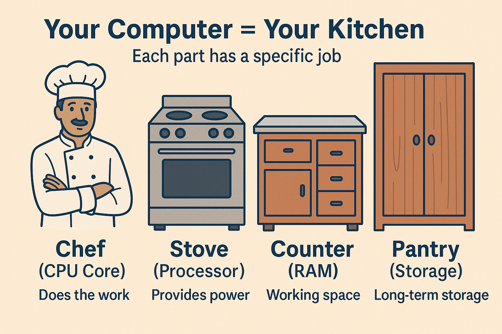
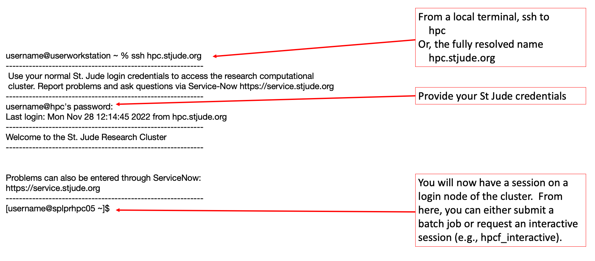
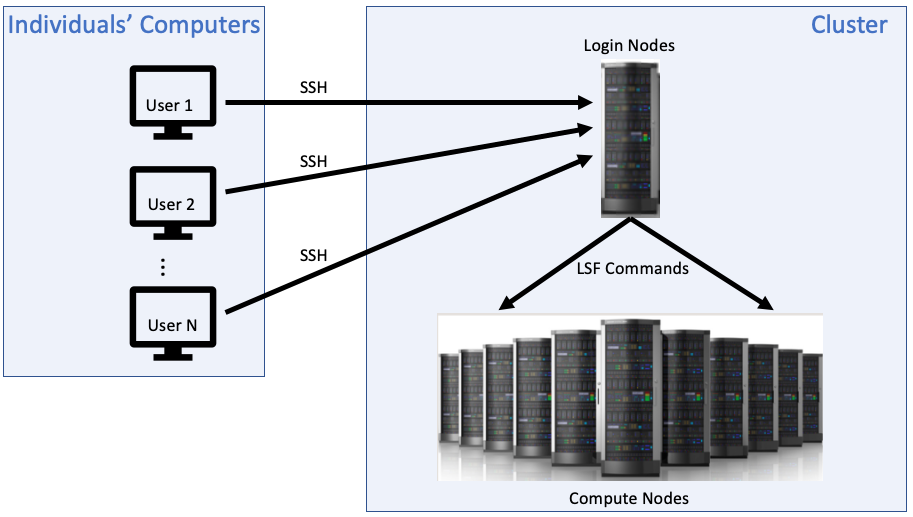
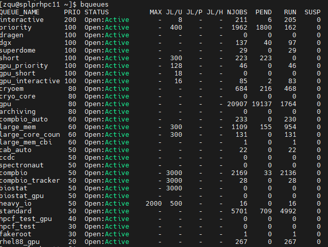

```{r setup, include=FALSE}
knitr::opts_chunk$set(echo = FALSE, eval = TRUE, warning = FALSE, message = FALSE)

load_or_install <- function(pkg) {
  if (!requireNamespace(pkg, quietly = TRUE)) {
    install.packages(pkg, repos = "https://cloud.r-project.org")
  }
  library(pkg, character.only = TRUE)
}

# List of required packages
packages <- c("ggplot2", "ggforce", "dplyr", "knitr", "doParallel", "survival", "foreach")

# Load or install all
invisible(lapply(packages, load_or_install))

```

## Welcome

### R on High-Performance Computing (HPC)
**Audience:** Clinical researchers, biologists, and chemists new to HPC scripting.

**Goal:** Show how R can be used efficiently on HPC systems like the St. Jude HPCF.


## 🍳 HPC as a Metaphor

> **Think of HPC as a gourmet kitchen with many chefs.**

- Laptop: one chef with one pan.
- HPC: 32 chefs, 32 pans, 1 recipe split up = faster meal!

**Key Concept:** Split your work so many nodes can help.


## CPU (Central Processing Unit) vs CPU Core
A CPU, or Central Processing Unit, is the main "brain" of a computer. A CPU core is a single processing unit within that CPU.

Think of the CPU as a house and the cores as rooms within that house. Each core can independently execute instructions, allowing the CPU to handle multiple tasks simultaneously. 

Modern CPUs often have multiple cores (dual-core, quad-core, etc.), enabling greater multitasking capabilities. 


## CPU (Kitchen) vs CPU Cores (Chefs)

```{r cpu-vs-core, echo=FALSE}
# CPU vs CPU Core visualization
cpu_data <- data.frame(
  component = c("CPU\n(Kitchen Station)", "Core 1\n(Chef)", "Core 2\n(Chef)", 
                "Core 3\n(Chef)", "Core 4\n(Chef)"),
  x = c(2.5, 1, 2, 3, 4),
  y = c(2, 1, 1, 1, 1),
  size = c(40, rep(25, 4)),
  color = c("red", "blue", "blue", "blue", "blue")
)

ggplot(cpu_data, aes(x = x, y = y, size = size, color = color)) +
  geom_point(alpha = 0.7) +
  geom_text(aes(label = component), size = 3, fontface = "bold", color = "black") +
  geom_segment(aes(x = 2.5, y = 1.65, xend = x, yend = 1.2),
               data = cpu_data[-1,], color = "gray", size = 1) +
  scale_size_identity() +
  scale_color_identity() +
  xlim(0, 5) + ylim(0.5, 2.5) +
  theme_void() +
  labs(title = "CPU = Kitchen Station, Core = Individual Chef",
       subtitle = "One CPU contains multiple cores (chefs working together)") +
  theme(plot.title = element_text(hjust = 0.5, size = 20),
        plot.subtitle = element_text(hjust = 0.5, size = 16))
```


## Think of HPC Like a Restaurant Kitchen I

```{r pressure, echo=FALSE}
# Kitchen analogy visualization
kitchen_data <- data.frame(
  item = c("Chef\n(CPU Core)", "Stove\n(Processor)", "Counter\n(RAM)", "Pantry\n(Storage)"),
  x = c(1, 2, 3, 4),
  y = c(1, 1, 1, 1),
  description = c("Does the work", "Provides power", "Working space", "Long-term storage")
)

ggplot(kitchen_data, aes(x = x, y = y)) +
  geom_point(size = 35, color = "lightblue") +
  geom_text(aes(label = item), size = 4, fontface = "bold") +
  geom_text(aes(label = description, y = 0.7), size = 4, color = "darkblue") +
  xlim(0.5, 4.5) + ylim(0.5, 1.5) +
  theme_void() +
  labs(title = "Your Computer = Your Kitchen",
       subtitle = "Each part has a specific job") +
  theme(plot.title = element_text(hjust = 0.5, size = 20),
        plot.subtitle = element_text(hjust = 0.5, size = 16))
```


## Think of HPC Like a Restaurant Kitchen II
```{r hpc-kitchen-image, echo=FALSE, out.width="80%", fig.align="center"}

```


## 📡 Job Monitoring (LSF States)
- The LSF (Load Sharing Facility) is like the restaurant maître d’ who keeps track of who's seated, who's still waiting, and who's finished their meal.

```{r lsf-analogy, echo=FALSE}
job_states <- data.frame(
  state = c("PEND", "RUN", "DONE", "EXIT"),
  description = c("Waiting in line", "Being served", "Finished meal", "Left unhappy"),
  count = c(15, 8, 45, 2),
  color = c("yellow", "green", "blue", "red")
)

ggplot(job_states, aes(x = state, y = count, fill = color)) +
  geom_col(alpha = 0.8) +
  geom_text(aes(label = description), vjust = -0.5, size = 3) +
  scale_fill_identity() +
  labs(title = "LSF Job States = Restaurant Service",
       subtitle = "Every job goes through these stages",
       x = "Job State", y = "Number of Jobs") +
  theme_minimal() +
  theme(plot.title = element_text(hjust = 0.5, size = 16))
```

##  Logging into St. Jude HPC

```bash
ssh your_username@hpc.stjude.org
```

- Use Terminal in Mac or MobaXterm in Windows.
```{r log-in, echo=FALSE, out.width="80%", fig.align="center"}

```

## 🔐 Logging nodes and 🧠 Compute Nodes
- Use the **login node** only to prepare and submit jobs — not to run heavy tasks!
```{r log and compute, echo=FALSE, out.width="80%", fig.align="center"}

```


## 📋 HPC Architecture

- **Login node**: Entry point
- **Compute nodes**: Where your R code runs
- **Scheduler (LSF, Load Sharing Facility)**: Manages job distribution
- In LSF, bsub is a command used to submit jobs, often specifying resource requirements and other parameters([the IBM documentation](https://www.ibm.com/docs/en/spectrum-lsf/10.1.0?topic=management-job-submission)). 

```bash
bsub < job.sh     # submit a job
bjobs             # check job status
bqueues           # view queue info
bkill <jobID>     # kill a job
```

## Bqueues Layout
```{r hpc bqueues, echo=FALSE, out.width="80%", out.height = "80%", fig.align="center"}

```


## 📊 HPC Queues vs Login/Compute Nodes I

```{r queue-nodes-plot, echo=FALSE, message=FALSE, warning=FALSE, fig.align='center', fig.width=5, fig.height=5}

# Create illustrative plot of login node, queues, and compute nodes
library(ggplot2)
library(ggforce)

queue_plot <- ggplot() +
  # Login node
  geom_rect(aes(xmin = 0.2, xmax = 1.8, ymin = 2.4, ymax = 3), fill = "skyblue", color = "black") +
  annotate("text", x = 1, y = 2.7, label = "Login Node", size = 5) +

  # Queues
  geom_rect(aes(xmin = 2.2, xmax = 3.8, ymin = 2.8, ymax = 3.4), fill = "lightgreen", color = "black") +
  annotate("text", x = 3, y = 3.1, label = "interactive queue") +

  geom_rect(aes(xmin = 2.2, xmax = 3.8, ymin = 2.0, ymax = 2.6), fill = "lightyellow", color = "black") +
  annotate("text", x = 3, y = 2.3, label = "gpu_priority queue") +

  geom_rect(aes(xmin = 2.2, xmax = 3.8, ymin = 1.2, ymax = 1.8), fill = "lightpink", color = "black") +
  annotate("text", x = 3, y = 1.5, label = "compbio queue") +

  # Arrows from login to queues
  geom_segment(aes(x = 1.8, y = 2.7, xend = 2.2, yend = 3.0), arrow = arrow(), size = 0.5) +
  geom_segment(aes(x = 1.8, y = 2.7, xend = 2.2, yend = 2.3), arrow = arrow(), size = 0.5) +
  geom_segment(aes(x = 1.8, y = 2.7, xend = 2.2, yend = 1.5), arrow = arrow(), size = 0.5) +

  # Compute nodes
  geom_rect(aes(xmin = 4.2, xmax = 5.8, ymin = 2.8, ymax = 3.4), fill = "lavender", color = "black") +
  annotate("text", x = 5, y = 3.1, label = "Compute Node 1") +

  geom_rect(aes(xmin = 4.2, xmax = 5.8, ymin = 2.0, ymax = 2.6), fill = "lavender", color = "black") +
  annotate("text", x = 5, y = 2.3, label = "Compute Node 2") +

  geom_rect(aes(xmin = 4.2, xmax = 5.8, ymin = 1.2, ymax = 1.8), fill = "lavender", color = "black") +
  annotate("text", x = 5, y = 1.5, label = "Compute Node 3") +

  # Arrows from queues to compute nodes
  geom_segment(aes(x = 3.8, y = 3.1, xend = 4.2, yend = 3.1), arrow = arrow(), size = 0.5) +
  geom_segment(aes(x = 3.8, y = 2.3, xend = 4.2, yend = 2.3), arrow = arrow(), size = 0.5) +
  geom_segment(aes(x = 3.8, y = 1.5, xend = 4.2, yend = 1.5), arrow = arrow(), size = 0.5) +

  theme_void() +
  ggtitle("Flow from Login Node → Queues → Compute Nodes")

print(queue_plot)
```


## 📊 HPC Queues vs Login/Compute Nodes II

- **Queues** define the *rules and policies* for job scheduling, like job duration, priority, resource type (e.g., GPU), or department usage.
- **Queues are not job types**; instead, they’re more like "lines with rules"—some lines move faster (priority), some serve special equipment (GPU), and some are restricted (lab-specific).
- **Nodes** are the actual hardware — CPUs, RAM, GPUs — where the work gets done.
- Jobs go from **login node → queue → compute node**.

Example:

- `interactive` queue: Allows interactive sessions like RStudio
- `gpu_priority`: For GPU-enabled jobs, with higher urgency
- `compbio`: A queue shared by Computational Biology groups
- `priority`: A queue with expedited scheduling
- `large_mem`: Reserved for high-RAM needs (e.g., 500+ GB)


## 🧭 Walkthrough: 3 Real-World Examples

| Example | Description | Mode | Why it Matters |
|--------|-------------|------|----------------|
| ✅ Small R Script | Read & summarize cancer dataset | Interactive & Batch | Illustrates two job submission styles |
| 🚀 Bootstrap | Cox models on 1000 bootstraps | Batch + Parallel | Shows clear speed-up using HPC |
| 🧠 GPU Matrix Mult | Matrix product on GPU | GPU + Batch | Showcases GPU for numeric computing |


## 🧪 Example 1: Small R Job – Interactive Mode

```terminal
$ bsub -P survival_analysis -q interactive -Is bash
$ module avail R
$module load R/4.4.0
$R
```
```{R script,echo=TRUE}
# Inside R session
library(dplyr)
library(survival)
data(cancer, package = "survival")
head(force(cancer))

# inst:	Institution code
# time:	Survival time in days
# status:	censoring status 1=censored, 2=dead
# age:	Age in years
# sex:	Male=1 Female=2
# ph.ecog:	ECOG performance score as rated by the physician. 0=asymptomatic, 1= symptomatic but completely ambulatory, 2= in bed <50% of the day, 3= in bed > 50% of the day but not bedbound, 4 = bedbound
# ph.karno:	Karnofsky performance score (bad=0-good=100) rated by physician
# pat.karno:	Karnofsky performance score as rated by patient
# meal.cal:	Calories consumed at meals
# wt.loss:	Weight loss in last six months (pounds)

results <- cancer %>% group_by(sex) %>%
  summarise(survival_rate = mean(time))
print(results)
# write.csv(results, "../../output/survival_analysis_interactive.csv")
```


## 🧪 Example 1: Small R Job – Batch Mode

**survival_analysis.R**
```{r analysis}
library(dplyr)
library(survival)
data(cancer, package = "survival")
results <- cancer %>% group_by(sex) %>%
  summarise(survival_rate = mean(time), .groups = "drop")
# write.csv(results, "../../output/survival_analysis_batch.csv")
```

**job1.sh**
```bash
#!/bin/bash
#BSUB -n 1
#BSUB -q priority
#BSUB -W 00:10
#BSUB -R "rusage[mem=2048]"
#BSUB -J survival_analysis
#BSUB -o log/output.%J.log
#BSUB -e log/error.%J.log

BASE_DIR=/research/rgs01/home/clusterHome/zqu/workshop07252025/code/
cd $BASE_DIR

module load R/4.4.0
Rscript R/survival_analysis.R
```


## 🚀 Example 2: Bootstrap with Parallelization (Test in Local)

**parallel_bootstrap.R**
```{r parallel and sequential, eval = FALSE, echo = TRUE}
library(survival)
library(doParallel)
library(foreach)

data(cancer, package = "survival")

# ----- 1. Parallel Execution -----
start_parallel <- Sys.time()

cl <- makeCluster(8)
registerDoParallel(cl)

coefs_parallel <- foreach(i = 1:10000, .combine = rbind, .packages = c("survival")) %dopar% {
  data(cancer, package = "survival")
  samp <- cancer[sample(nrow(cancer), replace = TRUE), ]
  coef(coxph(Surv(time, status) ~ age + sex, data = samp))
}

stopCluster(cl)

end_parallel <- Sys.time()
parallel_time <- end_parallel - start_parallel
time_value <- as.numeric(parallel_time)
time_unit <- attr(parallel_time, "units")
cat(sprintf("⏱️ Time taken (parallel): %.2f %s\n", time_value, time_unit))

# ----- 2. Sequential Execution -----
start_seq <- Sys.time()

coefs_seq <- matrix(NA, nrow = 10000, ncol = 2)
for (i in 1:nrow(coefs_seq)) {
  samp <- cancer[sample(nrow(cancer), replace = TRUE), ]
  fit <- coxph(Surv(time, status) ~ age + sex, data = samp)
  coefs_seq[i, ] <- coef(fit)
}

end_seq <- Sys.time()
sequential_time <- end_seq - start_seq
time_value <- as.numeric(sequential_time)
time_unit <- attr(sequential_time, "units")
cat(sprintf("⏱️ Time taken (sequential): %.2f %s\n", time_value, time_unit))

# Optional: Save outputs if needed
write.csv(coefs_parallel, "../output/bootstrap_coefs_parallel.csv", row.names = FALSE)
write.csv(coefs_seq, "../output/bootstrap_coefs_sequential.csv", row.names = FALSE)
```
## 🚀 Example 2: Bootstrap with Parallelization (Test in HPC)

```{r bootstrap_parallel_hpc, eval = FALSE}
library(doParallel)
library(foreach)

# Print number of cores from LSF (LSB_DJOB_NUMPROC)
ncores <- as.numeric(Sys.getenv("LSB_DJOB_NUMPROC", unset = 4))
cat("Running on", ncores, "cores\n")

cl <- makeCluster(ncores)
registerDoParallel(cl)

# Expensive task: matrix inversion
expensive_task <- function() {
  mat <- matrix(rnorm(1000^2), nrow = 1000) # Generate a large 1000x1000 matrix of random numbers
  inv <- solve(mat)                                # Invert the matrix (computationally expensive)
  return(inv)
}

# Parallel block
start_parallel <- Sys.time()
results_parallel <- foreach(i = 1:1000, .combine = 'c') %dopar% {
  max(expensive_task())  # Replace with mean(), max(), sd() if desired
}
end_parallel <- Sys.time()
parallel_time <- end_parallel - start_parallel
time_value <- as.numeric(parallel_time)
time_unit <- attr(parallel_time, "units")
cat(sprintf("⏱️ Time taken (parallel): %.2f %s\n", time_value, time_unit))


stopCluster(cl)

# Save results
write.csv(data.frame(index = 1:1000, max = results_parallel),
          "../output/parallel_summary.csv", row.names = FALSE)
```

**bootstrap_job.sh**
```bash
#BSUB -J r_parallel_bootstrap
#!/bin/bash
#BSUB -q priority
#BSUB -n 10
#BSUB -R "span[hosts=1]"        # All cores on one node
#BSUB -W 00:30  # Runtime limit hh:mm
#BSUB -R "rusage[mem=100000]"
#BSUB -o log/output.%J.log
#BSUB -e log/error.%J.log

BASE_DIR=/research/rgs01/home/clusterHome/zqu/workshop07252025/code/
cd $BASE_DIR

module load R/4.4.0
Rscript R/bootstrap_parallel_hpc.R
```

## 🔍 CPU vs GPU: Key Differences

| Feature               | CPU                          | GPU                           |
|-----------------------|-------------------------------|-------------------------------|
| Cores                | Few (2–64)                   | Hundreds to thousands         |
| Task Type            | Sequential tasks             | Parallelizable tasks          |
| Latency              | Low (good for logic)         | Higher (good for throughput)  |
| Memory Hierarchy     | Complex, flexible            | Simpler, faster bandwidth     |
| Best For             | General-purpose processing   | Large-scale matrix operations |

## ⚙️ Parallel Computation: CPU vs GPU in R

|                     | CPU Parallel (`doParallel`)   | GPU Parallel (`gpuR`)         |
|---------------------|-------------------------------|-------------------------------|
| Parallelism Type    | Multi-core                    | Many-core (SIMD)              |
| Ideal Use Case      | Independent iterations        | Matrix ops, deep learning     |
| Setup Complexity    | Low to Medium                 | Medium (GPU config required)  |
| Speed Improvement   | Moderate                      | High (if vectorized)          |
| Limitations         | Memory bottlenecks            | Data transfer & library limits|

- Without SIMD (CPU style): You make one cookie at a time — scoop dough, shape, bake, repeat.

- With SIMD (GPU style): You have a tray with 100 molds and pour dough into all of them at once — one instruction, multiple cookies baked together.

## 🧪 Matrix Inversion in R (Interactive HPC Node)
```bash
bsub -q gpu_interactive -n 1 -Is bash
module load R/4.1.2
```

```{r matrix-inversion-gpu, eval=FALSE, echo=TRUE}
library(gpuR)
library(microbenchmark)

# Matrix dimensions
n <- 1000

# GPU inversion
gpu_time <- microbenchmark({
  # 1. Generate data in CPU memory
x <- matrix(rnorm(n^2), nrow = n)

# 2. Transfer to GPU
mat_gpu <- gpuMatrix(x, type = "float")

# 3. Perform operations
inv_gpu <- solve(mat_gpu)

}, times = 1)

cat(sprintf("🧠 GPU Time: %.2f %s\n", gpu_time$time[1]/1e9, "seconds"))
```
- GPU Time: 1.51 seconds

```{r matrix-inversion-cpu, eval = FALSE}
library(microbenchmark)

# Matrix dimensions
n <- 1000
# CPU inversion
cpu_time <- microbenchmark({
  mat_cpu <- matrix(rnorm(n^2), nrow = n)
  inv_cpu <- solve(mat_cpu)
}, times = 1)

# Print time comparison
cat(sprintf("🖥️ CPU Time: %.2f %s\n", cpu_time$time[1]/1e9, "seconds"))
```
- CPU Time: 1.89 seconds


## 🧠 Example 3: GPU Matrix Multiplication

**gpu_inverse_job.R**
```{r gpu, eval = FALSE}
setwd("/research/rgs01/home/clusterHome/zqu/workshop07252025/code/")
library(gpuR)

# Use job index as a random seed for reproducibility
job_index <- as.integer(Sys.getenv("LSB_JOBINDEX", unset = 1))
set.seed(1000 + job_index)

# Matrix size
n <- 2000

# Generate matrix and move to GPU
x <- matrix(rnorm(n^2), nrow = n)
mat_gpu <- gpuMatrix(x, type = "float")

# Time the inversion and store the result
gpu_time <- system.time({
  inv_gpu <- solve(mat_gpu)
})

cat(sprintf("Job %d ?? GPU Inversion Time: %.2f seconds\n", job_index, gpu_time["elapsed"]))

# Create output directory if not exists
dir.create("../output", showWarnings = FALSE)

# Write the 5x5 preview of inverse matrix
outfile <- sprintf("../output/gpu_inv_head_job%02d.csv", job_index)
write.csv(as.matrix(inv_gpu[1:5, 1:5]), file = outfile, row.names = FALSE)

```

**gpu_job.sh**
```bash
#!/bin/bash
#BSUB -J gpu_inv_array[1-10]          # Job array: 10 parallel jobs
#BSUB -q gpu_priority                   # Use appropriate GPU queue
#BSUB -gpu "num=1"                   # Request 1 GPU per job
#BSUB -n 1                           # 1 CPU core is enough
#BSUB -R "rusage[mem=1GB]"           # Memory per job
#BSUB -W 0:15                        # Walltime
#BSUB -o log/gpu_job_%J_%I.out      # Stdout per array task
#BSUB -e log/gpu_job_%J_%I.err      # Stderr per array task

BASE_DIR=/research/rgs01/home/clusterHome/zqu/workshop07252025/code/

cd $BASE_DIR
# Load R module (adjust version as needed)
module load R/4.1.2

# Run R script
Rscript R/gpu_inverse_job.R
```


## 🧠 Best Practices
✅ Test on small data first  
✅ Use vectorized & parallel functions  
✅ Monitor jobs and scale accordingly  
✅ Request only what you need  
✅ Use job arrays or packages like `clustermq`, `batchtools`

## 📚 Resources

- [St. Jude HPC Home](https://wiki.stjude.org/display/HPCF/Home)
- [LSF Job Submission Guide](https://wiki.stjude.org/display/HPCF/LSF+Job+Submission)
- [Managing Jobs in LSF](https://wiki.stjude.org/display/HPCF/Managing+Jobs+in+LSF)


## 🙌 Thanks!
You can now run R jobs smarter and faster on HPC.  
Let the cluster cook for you 🍽️!
